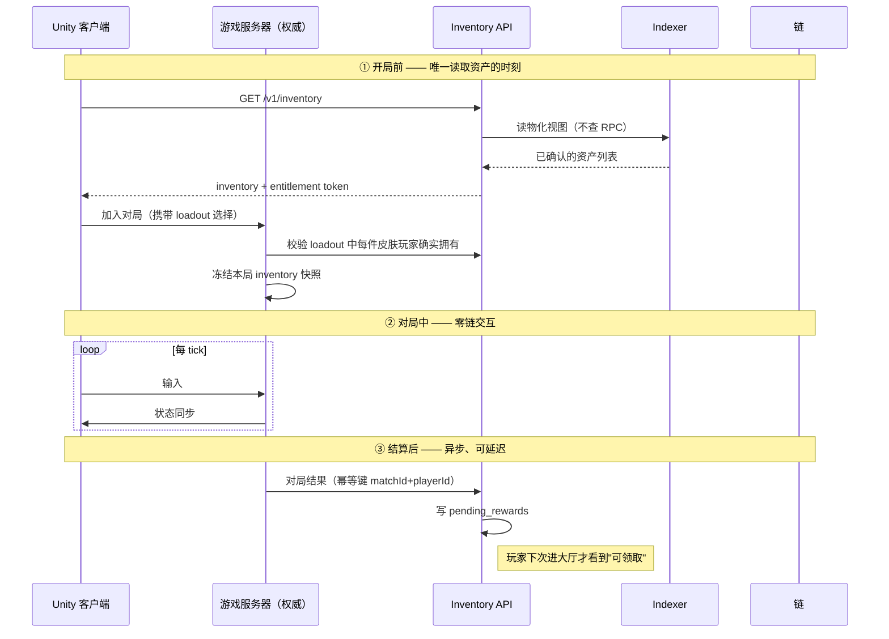

# 01 · 职责边界

## 核心矛盾

FPS 的实时性和区块链的确定性延迟在数量级上不可调和：

| 环节 | 时间尺度 |
|------|---------|
| FPS 客户端 tick | 16 ms（60Hz）|
| 权威服务器 tick | 16–33 ms |
| 玩家可容忍的操作延迟 | < 100 ms |
| L2 出块 | 1–2 s |
| L2 软确认（可安全展示） | 2–6 s |
| Optimistic Rollup 提现终局性 | ~7 天 |
| zk Rollup L1 终局性 | 20 min – 数小时 |

差了 **两到五个数量级**。因此边界不是"尽量少上链"，而是一条硬规则：

> **对局生命周期内（匹配成功 → 结算写入），不存在任何同步或异步的链交互。**

## 划分表

| 领域 | 归属 | 说明 |
|------|------|------|
| 移动 / 射击 / 命中判定 / 弹道回溯 | 游戏服务器 | 权威，与链完全隔离 |
| 反作弊裁决 | 游戏服务器 | 链无法判断作弊 |
| 玩家等级、经验、匹配分 | 链下数据库 | 高频写，无交易价值 |
| 游戏内软通货（金币） | 链下账本 | 见下方"为什么软通货不上链" |
| **皮肤 / 外观 NFT 的所有权** | **链上** | 玩家真正拥有的核心 |
| **皮肤稀缺性上限** | **链上** | 发行方不能背信超发 |
| **奖励发放的最终凭证** | **链上** | 可验证、可转让 |
| **二级交易与结算** | **链上** | 自由流通的前提 |
| **版税分成** | **链上** | EIP-2981 |
| 皮肤的贴图 / 模型 / AssetBundle | CDN（+ IPFS 备份哈希） | 链上只存承诺哈希 |
| 掉落概率表 | 链下配置 + 链上承诺哈希 | 合规披露需要，见 07 |

## 数据流的三个时刻

### 为什么是"开局快照"

匹配成功那一刻锁定玩家的资产快照，对局期间即使 NFT 被转走 / 卖掉，本局仍按快照渲染。理由：

- 对局中查链或查缓存都会引入不确定性和额外故障点；
- 中途换皮肤对其他玩家是视觉突变，体验差；
- 避免"卖掉皮肤后本局皮肤消失"这类需要客户端热重载的边缘情况。

快照存活期 = 一局时长（通常 < 30 min），过期即失效。

## 为什么软通货不上链

游戏内金币若做成 ERC-20：

1. **刷币即印钞** —— 任何反作弊漏网的刷分手段直接变成可套现的经济攻击，风险从"游戏平衡"升级为"资金安全"；
2. **合规面骤增** —— 可自由交易的同质化代币在多个司法辖区可能被认定为支付工具或证券；
3. **发放成本** —— 每局结算给几十个玩家发币，链上成本高于金币本身价值。

结论：v1 **不发行任何同质化代币**。金币走链下账本，链上只承载**非同质化的、有真实稀缺性的**外观资产。这条决定同时把整个项目从"GameFi"重新定位为"有真实资产所有权的传统游戏"，是刻意的取舍。

## 玩家能得到什么（对外承诺）

必须能对玩家讲清楚，否则"真正拥有"只是口号：

- 皮肤 NFT 在你自己的钱包里，我们**无法单方面收回**（合约无 burn/transfer 后门，见 04）；
- 每款皮肤的**发行上限写在合约里**，我们改不了；
- 你可以在任何支持该链的市场自由出售，**不需要经过我们**；
- 即使游戏停服，NFT 与其元数据仍在链上和 IPFS 上；
- 但：**皮肤在游戏内的可用性依赖游戏运营**，NFT 本身不是游戏账号的所有权。最后这条必须写进用户协议，不能含糊。
