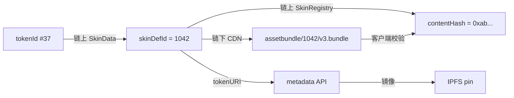
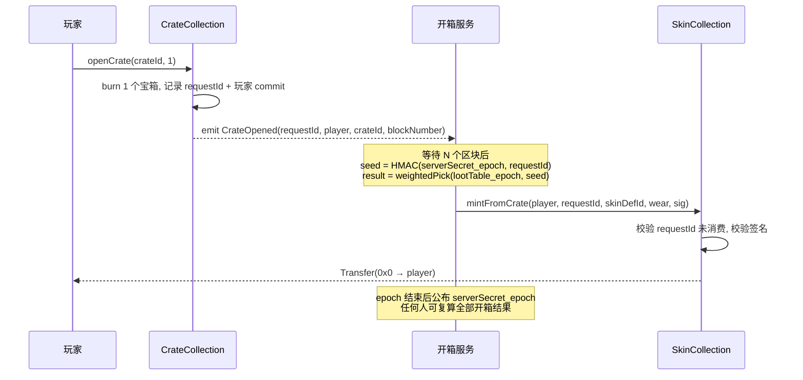

# 03 · 资产模型

## 资产分类与标准选择

| 资产 | 标准 | 上链 | 理由 |
|------|------|------|------|
| 武器皮肤（唯一编号） | ERC-721 | 是 | 每件有独立编号与磨损值，需要单件可追溯、可定价 |
| 通用宝箱 / 钥匙 | ERC-1155 | 是 | 同质、大批量、需要批量转移与销毁 |
| 赛季通行证 | ERC-1155（可设为不可转让）| 是 | 与账号绑定，标记赛季资格 |
| 挂件 / 喷漆等低价值饰品 | ERC-1155 | 是 | 单件价值低，721 的 mint 成本不划算 |
| 金币等软通货 | — | 否 | 见 01「为什么软通货不上链」 |
| 等级 / 经验 / 战绩 | — | 否 | 高频写，无交易价值 |

### 为什么皮肤用 721 而不是 1155

同一款皮肤（比如「霜蚀 AK」）会铸造多件，看起来像 1155 的场景。但每件需要携带**独立的可变属性**：

- `serialNumber` —— #1/500 的编号有真实溢价；
- `wear` —— 磨损值决定视觉与价格（CS 生态验证过的机制）；
- `mintedAt` / `seasonId` —— 首发赛季的溢价。

1155 的 fungible 语义无法承载"同 ID 不同价值"。因此：**skinDefinitionId 是款式，tokenId 是具体某一件**。

## 链上数据结构

```solidity
// 每件皮肤的链上状态（打包进 1 个 storage slot）
struct SkinData {
    uint32  skinDefId;      // 款式 ID，指向 SkinRegistry
    uint32  serialNumber;   // 该款式内的序号，从 1 开始
    uint16  wear;           // 磨损，0..10000（万分比），铸造时确定，不可变
    uint32  seasonId;       // 首发赛季
    uint64  mintedAt;       // 区块时间戳
}
mapping(uint256 tokenId => SkinData) internal _skinData;
```

`wear` 铸造后不可变。可变的磨损会引入"谁有权修改玩家资产"的问题 —— 一旦发行方能改，"真正拥有"就打了折扣。

### 款式注册表（SkinRegistry）

```solidity
struct SkinDefinition {
    uint32  maxSupply;      // 发行上限，一旦设置不可上调
    uint32  minted;         // 已铸造数
    uint8   rarity;         // 0..4
    bool    frozen;         // 冻结后 contentHash 不可再改
    bytes32 contentHash;    // 外观资源包的内容哈希（承诺）
}
mapping(uint32 skinDefId => SkinDefinition) public definitions;
```

**`maxSupply` 只允许下调，不允许上调。** 这是对玩家最实质的稀缺性承诺，写在合约里比写在白皮书里可信一个数量级。

## 外观契约：链上承诺 + 链下资源

这是整套设计里最容易做错的一环。Unity 加载的是 AssetBundle，不可能从链上读贴图。但如果外观完全在链下，发行方就能事后把「传说级皮肤」悄悄改成灰模。

解法是**内容哈希承诺**：



规则：

1. `contentHash` = AssetBundle 的 keccak256（含 LOD、贴图、材质的完整包）；
2. Unity 下载 bundle 后**本地校验哈希**，不匹配则拒绝加载并上报；
3. 修 bug 需要改资源时，必须走 `updateContentHash(skinDefId, newHash)`，该调用**触发链上事件 + ERC-4906 元数据更新事件**，任何人可审计变更历史；
4. `frozen = true` 后哈希永久锁死，用于「本赛季已结束、外观不再变更」的正式承诺；
5. 每次变更需经 Timelock（48h），玩家有时间发现并反对。

这样既保留了运营灵活性，又让"偷偷改外观"变成一个公开可见、有延迟的动作。

## 元数据（tokenURI）

`tokenURI(tokenId)` 返回 `https://meta.<domain>/v1/skin/{tokenId}`，响应遵循 OpenSea 元数据标准：

```json
{
  "name": "霜蚀 AK-47 #37",
  "description": "第 2 赛季竞技场奖励。",
  "image": "https://cdn.<domain>/skin/1042/preview.png",
  "external_url": "https://<domain>/item/37",
  "attributes": [
    { "trait_type": "Weapon",   "value": "AK-47" },
    { "trait_type": "Rarity",   "value": "Legendary" },
    { "trait_type": "Season",   "value": 2 },
    { "trait_type": "Serial",   "value": 37,   "max_value": 500 },
    { "trait_type": "Wear",     "value": 0.0731, "display_type": "number" }
  ],
  "content_hash": "0xab...",
  "bundle_uri": "https://cdn.<domain>/skin/1042/v3.bundle"
}
```

- **API 动态生成而非静态 JSON**：serial/wear 来自链上读取，保证与链一致；
- **同步 pin 一份到 IPFS**，并在款式 `frozen` 时把 IPFS CID 写入链上，保证游戏停服后元数据仍可访问；
- `bundle_uri` 是给自家客户端的扩展字段，市场会忽略它。

## 宝箱与开箱

宝箱是 ERC-1155。开箱涉及随机数，是最容易出安全事故的地方。

**不使用**：`block.timestamp`、`blockhash`、`prevrandao` 单独作为随机源 —— 在 L2 上排序器可预测/可操纵。

**方案：提交-揭示 + 链下 VRF 记录**



要点：

- `serverSecret_epoch` 的 **哈希在 epoch 开始时上链**，结束后公布明文，任何人可验证所有开箱结果没有被事后调整；
- `lootTable_epoch` 的哈希同样上链承诺（多个司法辖区强制要求概率披露且不得篡改）；
- 焚烧宝箱和铸造皮肤是**两笔交易**，中间失败必须可恢复：`requestId` 持久化在链上，开箱服务有重试与人工补发通道，且铸造侧以 `requestId` 做幂等；
- 若要完全去信任，可换成 Chainlink VRF，代价是每次开箱增加成本和 2 个区块延迟。**v1 用提交-揭示，v2 视需求评估 VRF。**

## Token ID 分配

```
tokenId = (uint256(skinDefId) << 32) | serialNumber
```

好处：从 tokenId 可直接反推款式和序号，索引器和前端无需额外查询；坏处：tokenId 不连续，部分工具展示不友好。权衡后取前者 —— 可读性对调试和客服的价值更高。

## 不可转让资产

赛季通行证、成就徽章这类"不该被交易"的资产，用 ERC-1155 + 覆写 `_update` 阻止转移（soulbound）。**注意**：这类资产不应对外宣称为"你拥有的 NFT"，避免与核心承诺冲突。它们的定位是凭证，不是资产。
