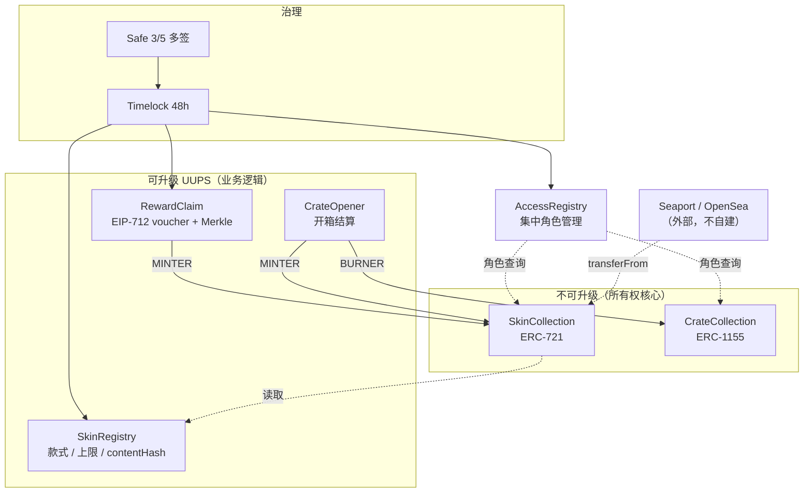

# 04 · 合约架构

## 全景



## 可升级性策略（关键决策）

**资产合约不可升级，周边合约可升级。**

| 合约 | 可升级 | 理由 |
|------|--------|------|
| `SkinCollection` | ❌ | 持有所有权的合约一旦可升级，"我们无法收回你的资产"这句承诺就是假的 —— 一次升级就能加个 `adminBurn`。不可升级是唯一诚实的选项 |
| `CrateCollection` | ❌ | 同上 |
| `SkinRegistry` | ✅ UUPS | 需要新增款式字段、调整稀有度体系 |
| `RewardClaim` | ✅ UUPS | 奖励规则会频繁演进 |
| `CrateOpener` | ✅ UUPS | 掉落逻辑会演进 |

代价：`SkinCollection` 有 bug 就只能部署新合约 + 引导迁移，玩家旧 NFT 不会自动变成新的。为此：

- 合约保持**极简**（只做 mint / transfer / 元数据指针），逻辑全部外移到可升级的周边；
- 上线前必须审计 + 至少一轮公开测试网运行；
- 预留 `IMigrationTarget` 接口，若真需要迁移，走玩家自愿的 burn-to-claim，而不是管理员强制。

## 合约接口草案

### AccessRegistry

集中的角色管理，避免每个合约各自维护一套 `AccessControl` 导致权限散落。

```solidity
interface IAccessRegistry {
    function hasRole(bytes32 role, address account) external view returns (bool);
}

bytes32 constant MINTER_ROLE         = keccak256("MINTER_ROLE");
bytes32 constant BURNER_ROLE         = keccak256("BURNER_ROLE");
bytes32 constant REWARD_SIGNER_ROLE  = keccak256("REWARD_SIGNER_ROLE");
bytes32 constant PAUSER_ROLE         = keccak256("PAUSER_ROLE");
bytes32 constant REGISTRY_ADMIN_ROLE = keccak256("REGISTRY_ADMIN_ROLE");
```

`DEFAULT_ADMIN_ROLE` 持有者是 Timelock，Timelock 的提议者是 Safe。`PAUSER_ROLE` 例外 —— 授予一个热钱包，紧急暂停必须能立即执行，不能等 48 小时。暂停只能停 **mint**，**不能停 transfer**（否则等于冻结玩家资产）。

### SkinCollection

```solidity
interface ISkinCollection is IERC721, IERC2981 {
    struct SkinData {
        uint32 skinDefId;
        uint32 serialNumber;
        uint16 wear;
        uint32 seasonId;
        uint64 mintedAt;
    }

    /// @notice 铸造一件皮肤。仅 MINTER_ROLE。
    /// @dev 供应上限由 SkinRegistry 强制，本合约调用 registry.consumeSupply()
    function mint(address to, uint32 skinDefId, uint16 wear, uint32 seasonId)
        external returns (uint256 tokenId);

    function skinData(uint256 tokenId) external view returns (SkinData memory);

    /// @notice 持有者销毁自己的资产。没有管理员销毁接口。
    function burn(uint256 tokenId) external;
}
```

**刻意不提供的接口**：`adminTransfer`、`adminBurn`、`setOwner(tokenId, addr)`、可切换的 `transferEnabled` 开关。任何一个都会让所有权承诺失效。

### SkinRegistry

```solidity
interface ISkinRegistry {
    function defineSkin(uint32 skinDefId, uint32 maxSupply, uint8 rarity, bytes32 contentHash) external;

    /// @notice 上限只能下调，永不能上调。
    function reduceMaxSupply(uint32 skinDefId, uint32 newMax) external;

    /// @notice 更新外观资源哈希。经 Timelock，触发 ERC-4906 事件。
    function updateContentHash(uint32 skinDefId, bytes32 newHash) external;

    /// @notice 冻结后 contentHash 永久不可变。单向操作。
    function freeze(uint32 skinDefId) external;

    /// @notice 由 SkinCollection 调用，原子地占用一个供应额度并返回序号。
    function consumeSupply(uint32 skinDefId) external returns (uint32 serialNumber);
}
```

### RewardClaim

两种发放路径共存：

```solidity
interface IRewardClaim {
    struct Voucher {
        address player;
        uint32  skinDefId;
        uint16  wear;
        uint32  seasonId;
        uint256 nonce;      // 每个 player 独立自增
        uint64  deadline;
    }

    /// @notice 零散、实时奖励。EIP-712 签名，签名者须持 REWARD_SIGNER_ROLE。
    function claim(Voucher calldata v, bytes calldata signature) external;

    /// @notice 赛季批量奖励。一次上链一个 root，成本 O(1)。
    function setSeasonRoot(uint32 seasonId, bytes32 root, uint64 expiry) external;
    function claimFromSeason(
        uint32 seasonId,
        uint32 skinDefId,
        uint16 wear,
        uint256 index,
        bytes32[] calldata proof
    ) external;

    function isNonceUsed(address player, uint256 nonce) external view returns (bool);
    function isSeasonClaimed(uint32 seasonId, uint256 index) external view returns (bool);
}
```

EIP-712 domain 必须包含 `chainId` 与 `verifyingContract`，防止跨链、跨环境重放（测试网签名不能在主网生效）。

Nonce 用 **bitmap** 存储（`mapping(address => mapping(uint256 => uint256))`），每个 nonce 只占 1 bit，比 `mapping(uint256 => bool)` 省约 80% 的 gas，在批量领取场景差别显著。

### Merkle drop vs Voucher 的选择

| | Voucher | Merkle Drop |
|---|---------|-------------|
| 上链成本（发行方） | 0 | 1 笔（设置 root） |
| 上链成本（玩家） | 1 笔 mint | 1 笔 mint + proof calldata |
| 生成延迟 | 即时 | 需等批次汇总 |
| 适合 | 单次高价值掉落、赛事奖励 | 赛季结算、大规模空投 |
| 撤销能力 | 改 nonce 无效化（需上链） | 换 root 即可批量作废 |

两者都实现。规则：**单笔奖励 → voucher；批次 ≥ 1000 人 → Merkle。**

## 版税

EIP-2981，默认 5%，收款地址为 Safe。

必须坦诚的一点：**EIP-2981 只是信息接口，不强制执行**。Blur 等市场可以完全忽略。可强制的方案（如 ERC-721C / 转移白名单）代价是**限制了玩家的转移自由** —— 与核心承诺直接冲突。

决策：**采用 EIP-2981，不做强制**。宁可少收版税，也不破坏"自由流通"。在主流市场（OpenSea 等）仍会被尊重，这是可接受的收益。

## Gas 预算目标

| 操作 | 目标 gas | 备注 |
|------|---------|------|
| `mint`（首次铸造给某地址） | < 110k | SkinData 打包进 1 slot |
| `claim`（voucher） | < 145k | 含 ECDSA 验签 + nonce bitmap |
| `claimFromSeason`（深度 17 的 proof） | < 175k | |
| `transferFrom` | < 60k | 标准 721 |
| `openCrate`（burn） | < 55k | |

这些是**测试里的断言值**，不是文档里的愿望 —— Foundry 的 `gas_snapshot` 纳入 CI，超标即失败。

## 测试要求

超出常规单测的部分：

- **Invariant 测试**（Foundry）：
  - `definitions[id].minted <= definitions[id].maxSupply` 在任意调用序列下恒成立；
  - 全部 tokenId 的持有者集合，与 Transfer 事件回放出的集合一致；
  - 任何非持有者调用序列都无法改变某个 tokenId 的 owner。
- **Fuzz**：`wear` / `serialNumber` 边界、tokenId 打包解包的往返一致性。
- **Fork 测试**：在 Base fork 上跑一遍完整的 claim → transfer → Seaport 挂单流程。
- **签名重放测试**：同一 voucher 二次提交、换 chainId 提交、过 deadline 提交，均须 revert。
