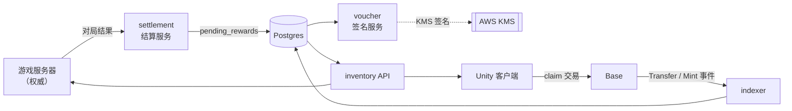

# 05 · 链下服务

链上合约只占整个系统的一小部分。真正决定体验和可靠性的是这四个服务。



## settlement · 结算服务

**输入**：游戏服务器在对局结束后推送结果。
**输出**：`pending_rewards` 行。

```
POST /internal/v1/match-result
{
  "matchId": "m_01HX...",
  "seasonId": 2,
  "results": [
    { "playerId": "p_123", "placement": 1, "rewards": [{ "slot": 0, "skinDefId": 1042 }] }
  ]
}
```

铁律：

1. **幂等键 = `(matchId, playerId, slot)`**，唯一索引。游戏服务器重试推送是常态，重复发奖是事故。
2. 结算服务**不信任客户端**，只接受来自游戏服务器的内网调用（mTLS 或签名的服务间令牌）。
3. 奖励绑定 **playerId（游戏账号）**，不是钱包地址。钱包是账号的一个属性，可以更换；奖励的归属必须锚在账号上。
4. 反作弊评分未通过的对局，`pending_rewards.state = 'held'`，人工复核后才转 `claimable`。这是防女巫刷奖的关键闸门 —— 一旦发到链上就不可撤回。

状态机：

```
held ──复核通过──> claimable ──玩家领取──> claiming ──链上确认──> claimed
  │                     │                      │
  └──复核不通过──> void   └──过期──> expired      └──失败──> claimable（可重试）
```

## voucher · 签名服务

唯一持有 `REWARD_SIGNER_ROLE` 私钥的服务。它是整个系统安全性最集中的一点，因此边界要极窄。

设计约束：

- **私钥永不出 KMS**。服务调 KMS 的 `Sign` API，本地内存里从不出现私钥。
- **服务只做一件事**：读一行 `claimable` 的 pending_reward，产出对应的 EIP-712 签名。不接受任意入参签名 —— 请求体只有 `rewardId`，其余字段全部从数据库读，客户端无法指定 `skinDefId`。
- **限额**：单个 signer 每日签名数上限、单玩家每日上限，超限触发告警并拒签。
- **审计日志**：每次签名写不可变日志（append-only 表 + 定期归档），包含 rewardId、玩家、结果哈希、KMS 请求 ID。
- **可轮换**：`REWARD_SIGNER_ROLE` 支持多个签名者。泄露时通过 Timelock 撤销旧 signer，已签发但未使用的 voucher 会随之失效（合约验签时查 `hasRole`）。

> 注意最后一点的取舍：把 `hasRole` 检查放在验签时，意味着撤销 signer 会作废该 signer 签发的所有未领取 voucher，包括合法的。这是刻意的 —— 泄露时"宁可让玩家重新领一次"，也不能让攻击者继续 mint。重新签发对玩家是无感的（数据库里的 pending_reward 还在）。

## indexer · 索引服务

监听 `SkinCollection` 与 `CrateCollection` 的 `Transfer` / `TransferSingle` / `TransferBatch` 事件，维护 `player_inventory` 物化视图。

### Reorg 处理

Base 是 OP Stack，L2 reorg 罕见但**不是不可能**（排序器故障、重组）。不能假设不发生。

```
写入策略：
  区块 confirmations < 12  → 标记 pending，inventory 中以「待确认」展示，不可用于 loadout
  区块 confirmations >= 12 → 标记 confirmed，进入可用 inventory
  检测到 reorg              → 回滚受影响区块高度以上的全部记录，从分叉点重放
```

实现要点：

- 每条 inventory 记录保存 `blockNumber` + `blockHash`；
- 每轮轮询校验最新 N 个区块的 `blockHash` 是否与已存记录一致，不一致即触发回滚；
- **回滚必须是幂等且可重入的** —— 服务在回滚中途崩溃后重启，要能继续，不能留下半回滚状态。用「记录 reorg 任务 → 执行 → 标记完成」的三段式。

### 为什么自建而不用 The Graph

- 需要与 `pending_rewards`、玩家账号在同一个 Postgres 事务里 join，托管索引服务做不到；
- reorg 语义需要按业务定制（"待确认的皮肤不能上场"这条规则是游戏逻辑，不是索引逻辑）；
- 查询延迟可控。

代价是要自己处理重放、断线续传、多实例选主。用 Postgres advisory lock 做单写者即可，规模远未到需要分片。

## inventory API

游戏服务器与客户端读取资产的唯一入口。**任何路径都不允许直接查链 RPC** —— RPC 的 p99 延迟和可用性都不满足开局前的要求。

```
GET /v1/inventory
  → 200 {
      "playerId": "p_123",
      "wallet": "0x...",
      "items": [
        { "tokenId": "4475210235940901", "skinDefId": 1042, "serial": 37,
          "wear": 0.0731, "bundleUri": "...", "contentHash": "0xab...",
          "state": "confirmed" }
      ],
      "pendingRewards": [ { "rewardId": "r_9", "skinDefId": 1042, "expiresAt": "..." } ]
    }

POST /v1/loadout        # 玩家设置出场配置
  → 校验每个 tokenId 当前属于该玩家且 state = confirmed

POST /internal/v1/entitlement-check   # 游戏服务器开局前调用
  → { "valid": true, "snapshotId": "s_...", "items": [...] }
```

`entitlement-check` 返回的 `snapshotId` 就是 01 里说的开局快照，游戏服务器持有它直到本局结束。

### 缓存与降级

| 依赖故障 | 降级行为 |
|---------|---------|
| indexer 落后（延迟 > 60s） | inventory 仍可读（返回稍旧数据）+ 打点告警。**不阻塞开局** |
| Postgres 不可用 | 从 Redis 读最近一次快照；仍不可用则**允许玩家用默认皮肤开局**。绝不因资产层故障阻止玩家进入游戏 |
| 链 RPC 不可用 | 领奖功能不可用（灰显 + 提示），游戏本体不受影响 |

最后一条是整个链下设计的底线：**Web3 层的任何故障都不得阻断核心游戏体验**。资产层是增值，不是依赖。
