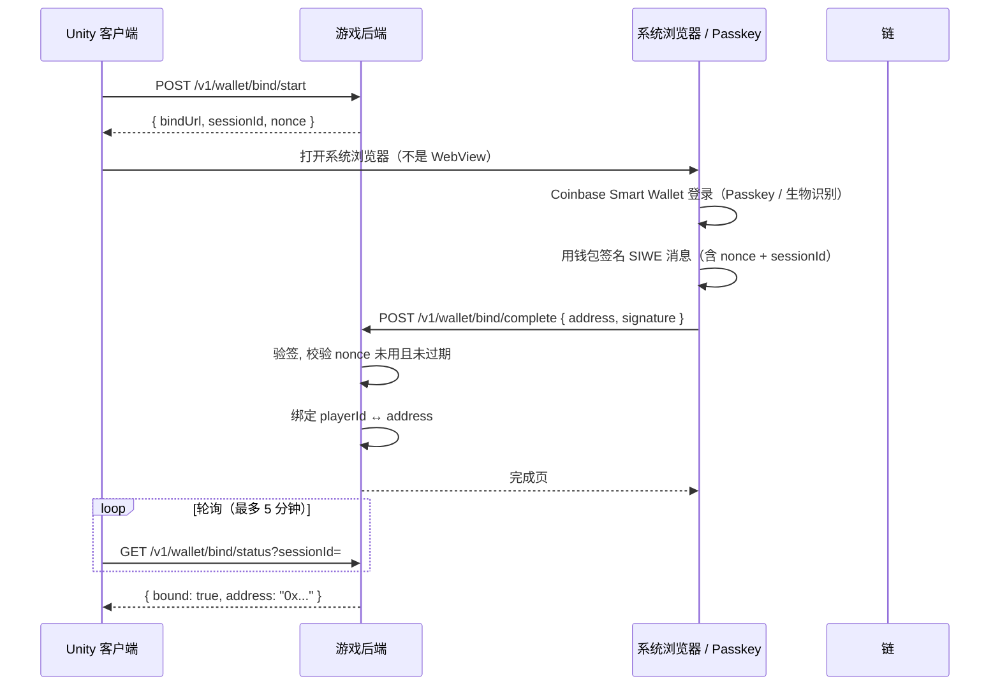
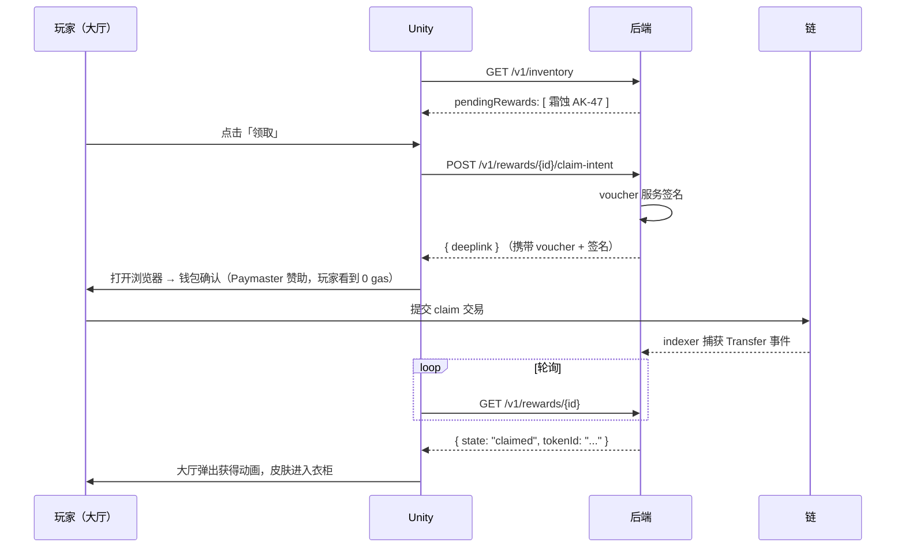

# 06 · Unity 集成与钱包 UX

## 第一原则：Unity 客户端不碰私钥，也不碰链

理由不是麻烦，是安全：

1. **Unity 客户端是完全不可信环境。** IL2CPP 可被逆向，内存可被 dump。任何放进客户端的私钥都等于公开。
2. FPS 玩家群体是外挂工具的重点目标，一旦游戏客户端里有钱包，作弊工具会顺手加上盗号功能。
3. 客户端直连 RPC 意味着把 RPC key 和调用逻辑暴露给攻击者。

因此：**Unity ↔ 游戏后端（HTTPS）↔ 链**。Unity 侧的 Web3 SDK 只是一个 REST 客户端，不含任何加密库。

## 钱包绑定流程

玩家用传统方式（邮箱 / Steam / 手机）登录游戏账号，钱包是**后绑定的属性**。



要点：

- **用系统浏览器，不用 Unity 内嵌 WebView。** 内嵌 WebView 里游戏进程可以读取页面内容，是钓鱼与凭据窃取的温床，且部分钱包会拒绝在 WebView 中工作。
- SIWE（EIP-4361）消息必须含 nonce、domain、过期时间。
- 一个 playerId 只能绑定一个地址；换绑需冷却期（建议 7 天）+ 邮件确认，防止账号被盗后立即转移绑定。
- **绑定 ≠ 托管**。后端不持有玩家私钥，只记录地址。

## 领奖流程（对玩家的体感）



Paymaster 只赞助白名单方法（`RewardClaim.claim`、`RewardClaim.claimFromSeason`、`CrateOpener.openCrate`），并设每日预算上限。超预算时降级为玩家自付并明确提示，不静默失败。

## Unity 侧 C# 接口草案

```csharp
namespace Game.Web3
{
    public interface IAssetService
    {
        // 开局前调用一次；结果缓存至本局结束
        UniTask<Inventory> GetInventoryAsync(CancellationToken ct = default);

        UniTask<WalletBindSession> StartWalletBindAsync(CancellationToken ct = default);
        UniTask<WalletBindResult>  PollWalletBindAsync(string sessionId, CancellationToken ct = default);

        UniTask<ClaimIntent> CreateClaimIntentAsync(string rewardId, CancellationToken ct = default);
        UniTask<RewardState> PollRewardAsync(string rewardId, CancellationToken ct = default);

        UniTask SetLoadoutAsync(Loadout loadout, CancellationToken ct = default);
    }

    public readonly struct InventoryItem
    {
        public readonly string TokenId;      // string，不是 ulong —— uint256 放不进 C# 原生类型
        public readonly uint   SkinDefId;
        public readonly uint   Serial;
        public readonly float  Wear;         // 0..1
        public readonly string BundleUri;
        public readonly string ContentHash;  // 校验用
        public readonly ItemState State;     // Confirmed / Pending
    }

    public enum ItemState { Confirmed, Pending }
}
```

注意 `TokenId` 用 `string`：uint256 超出 `ulong` 范围，用数值类型迟早溢出。所有链上大整数在 C# 侧一律走字符串。

## 皮肤加载与哈希校验

```csharp
public async UniTask<GameObject> LoadSkinAsync(InventoryItem item)
{
    var bytes = await _cdn.DownloadAsync(item.BundleUri);

    var actual = Convert.ToHexString(SHA3_256.HashData(bytes)).ToLowerInvariant();
    if ("0x" + actual != item.ContentHash)
    {
        _telemetry.ReportAssetHashMismatch(item.SkinDefId, item.ContentHash, actual);
        return _fallback.GetDefaultSkin(item.SkinDefId);   // 降级，不崩溃
    }

    var bundle = await AssetBundle.LoadFromMemoryAsync(bytes);
    return bundle.LoadAsset<GameObject>($"skin_{item.SkinDefId}");
}
```

哈希不匹配时**降级到默认皮肤并上报**，而不是拒绝进入游戏 —— CDN 缓存不一致是运维常态，不该变成玩家的阻断问题。但上报必须触发告警，因为它也可能是 CDN 被投毒。

（`SHA3_256` 是示意 —— 链上用 keccak256，Unity 侧需引入一个 keccak 实现，注意 keccak256 与 SHA3-256 的 padding 不同，不能混用。这是个常见的踩坑点。）

## 其他玩家的皮肤怎么同步

不能让每个客户端去查其他 9 个玩家的 inventory。做法：

1. 玩家加入对局时，**游戏服务器**已通过 `entitlement-check` 拿到该玩家的合法 loadout；
2. 游戏服务器把全场玩家的 `(playerId, slotIndex, skinDefId, wear, contentHash)` 一次性下发给所有客户端；
3. 客户端按需从 CDN 拉取未缓存的 bundle。

这样：链的可信性由服务器代为验证，客户端只做渲染。**客户端上报的皮肤 ID 一律不信任** —— 否则任何人都能改内存穿上传说皮肤。

## 网络与预热

- bundle 在**匹配等待阶段**预热下载，不在进入对局后加载，避免开局卡顿；
- 常见款式随游戏本体分发或首次启动预下载；
- 单个 bundle 建议 < 8 MB，超出时拆 LOD 分级加载。
