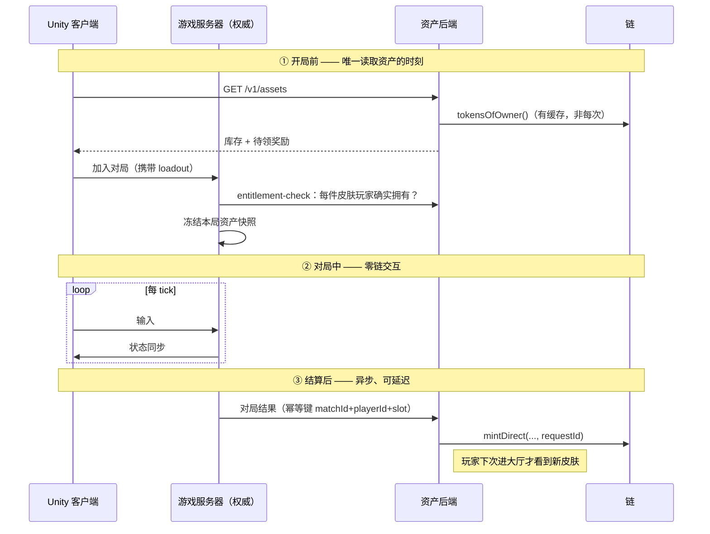

# 架构与边界

## 硬规则：对局中不碰链

FPS 的实时性和链的确定性延迟差两到五个数量级：

| 环节 | 时间尺度 |
|------|---------|
| FPS 客户端 tick | 16 ms |
| 玩家可容忍的操作延迟 | < 100 ms |
| L2 出块 | 1–2 s |
| L2 软确认（可安全展示） | 2–6 s |

所以边界不是"尽量少上链"，而是：

> **对局生命周期内（匹配成功 → 结算写入），不存在任何同步或异步的链交互。**

只在三个时刻碰链：

### 开局快照

匹配成功那一刻锁定资产快照，对局期间即使 NFT 被卖掉，本局仍按快照渲染。理由：

- 对局中查链或查缓存都会引入不确定性和额外故障点；
- 中途换皮肤对其他玩家是视觉突变；
- 避免"卖掉皮肤后本局皮肤消失"这类需要热重载的边缘情况。

## 链上 / 链下划分

| 领域 | 归属 |
|------|------|
| 移动 / 射击 / 命中判定 / 反作弊 | 游戏服务器，与链完全隔离 |
| 等级、经验、匹配分 | 链下数据库 |
| 游戏内软通货 | 链下账本（见下） |
| **皮肤所有权** | **链上** |
| **发行上限** | **链上**（`GameAssetRegistry.maxSupply`） |
| **奖励发放凭证** | **链上** |
| **二级交易与版税** | **链上** |
| 贴图 / 模型 / AssetBundle | CDN，链上只存 `contentHash` 承诺 |

### 不发任何同质化代币

已确认的决定。原因：

1. **刷币即印钞** —— 任何反作弊漏网的刷分手段直接变成可套现的经济攻击，
   风险从"游戏平衡"升级为"资金安全"；
2. **合规面骤增** —— 可自由交易的同质化代币在多个司法辖区可能被认定为支付工具；
3. **发放成本** —— 每局给几十个玩家发币，链上成本高于代币本身价值。

链上只承载**非同质化的、有真实稀缺性的**外观资产。这把项目定位为"有真实资产
所有权的传统游戏"，不是 GameFi。

## 链选型：Base Sepolia → Base

**hackathon 用 Base Sepolia**，主网路径是 Base。

按 hackathon 的实际约束排序：

1. **标准 EVM** —— Foundry / OZ / 所有工具链开箱即用，没有学习成本。
2. **测试网水龙头好拿、区块 2 秒** —— demo 现场不会卡在等确认。
3. **Coinbase Smart Wallet 用 Passkey 登录**，没有助记词，评委不需要装 MetaMask
   就能试。这在演示时是实打实的加分项。
4. 主网上二级市场流动性最好（OpenSea / Blur / Magic Eden 全支持），
   "自由流通"这个承诺才成立。

对比过的其他选项，以及为什么没选：

| 链 | 为什么不选 |
|----|-----------|
| Immutable zkEVM | 协议层免 gas 很香，但资产基本只能在自家市场流通，和"自由流通"的承诺自相矛盾；接入还需审核 |
| Ronin | 2022 年桥被盗 $6.2 亿，声誉风险不值得 |
| Polygon PoS | 便宜，但正在向 AggLayer 迁移，技术路线不确定 |
| Sui / Aptos | 对象模型确实更适合游戏资产，但 Solidity 技能与审计生态全部作废 |

**不做多链。** 会把库存一致性、跨链桥、市场碎片化的复杂度全引进来，收益只是营销故事。

## hackathon 特有的简化

以下都是**刻意为了 demo 砍掉的**，上主网前必须补回：

| 砍掉的 | 主网上需要 |
|--------|-----------|
| 多签 + Timelock | 现在管理员是单个 EOA。主网需 Safe 3/5 + 48h Timelock |
| 索引服务 | 靠 `ERC721Enumerable` 直接 `tokensOfOwner()` 读库存，实测多花 80k gas/mint 换零索引基建 |
| 12 区块确认 / reorg 回滚 | 现在乐观显示。主网需确认数门槛与回滚逻辑 |
| 反作弊人工闸门 | 现在结算即发奖。主网需 `held → claimable` 复核，因为**上链即不可撤回** |
| KMS 密钥管理 | 现在签名密钥在环境变量。主网必须进 KMS |
| 外部审计 | 必须做 |
| 宝箱 / 开箱 | 未实现。涉及随机数与多地区博彩合规，不是 hackathon 该碰的 |

这张表本身就是 demo 时的加分材料 —— 能说清楚自己砍了什么、为什么砍、什么时候补，
比假装一切都做完了更可信。

## 对玩家的承诺（必须能讲清楚）

- 皮肤 NFT 在你自己的钱包里，我们**无法单方面收回**（合约里没有 `adminBurn`
  或 `adminTransfer`，有测试专门守着这一点）；
- 每款皮肤的**发行上限写在合约里，只能降不能升**；
- 你可以在任何支持该链的市场自由出售，不需要经过我们；
- 但：**皮肤在游戏内的可用性依赖游戏运营**，NFT 本身不是游戏账号的所有权。
  最后这条必须写进用户协议，不能含糊。
