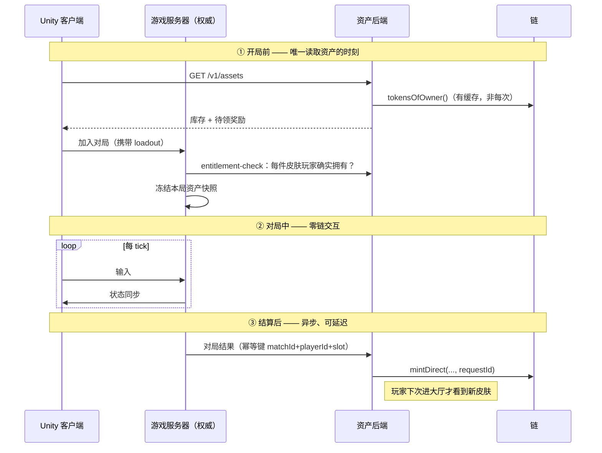

# 架构与边界

## 硬规则：对局中不碰链

FPS 的实时性和链的确定性延迟差两到五个数量级：

| 环节 | 时间尺度 |
|------|---------|
| FPS 客户端 tick | 16 ms |
| 玩家可容忍的操作延迟 | < 100 ms |
| L2 出块 | 1–2 s |
| L2 软确认（可安全展示） | 2–6 s |

所以边界不是"尽量少上链"，而是：

> **对局生命周期内（匹配成功 → 结算写入），不存在任何同步或异步的链交互。**

只在三个时刻碰链：

### 开局快照

匹配成功那一刻锁定资产快照，对局期间即使 NFT 被卖掉，本局仍按快照渲染。理由：

- 对局中查链或查缓存都会引入不确定性和额外故障点；
- 中途换皮肤对其他玩家是视觉突变；
- 避免"卖掉皮肤后本局皮肤消失"这类需要热重载的边缘情况。

## 链上 / 链下划分

| 领域 | 归属 |
|------|------|
| 移动 / 射击 / 命中判定 / 反作弊 | 游戏服务器，与链完全隔离 |
| 等级、经验、匹配分 | 链下数据库 |
| 游戏内软通货 | 链下账本（见下） |
| **皮肤所有权** | **链上** |
| **发行上限** | **链上**（`GameAssetRegistry.maxSupply`） |
| **奖励发放凭证** | **链上** |
| **二级交易与版税** | **链上** |
| 贴图 / 模型 / AssetBundle | CDN，链上只存 `contentHash` 承诺 |

### 不发任何同质化代币

已确认的决定。原因：

1. **刷币即印钞** —— 任何反作弊漏网的刷分手段直接变成可套现的经济攻击，
   风险从"游戏平衡"升级为"资金安全"；
2. **合规面骤增** —— 可自由交易的同质化代币在多个司法辖区可能被认定为支付工具；
3. **发放成本** —— 每局给几十个玩家发币，链上成本高于代币本身价值。

链上只承载**非同质化的、有真实稀缺性的**外观资产。这把项目定位为"有真实资产
所有权的传统游戏"，不是 GameFi。

## 链：Monad

已定。开发在 **Monad 测试网**，部署目标是 **Monad 主网**。

| | chain ID | RPC | 浏览器 |
|---|---|---|---|
| 测试网 | `10143` | `https://testnet-rpc.monad.xyz` | `https://testnet.monadexplorer.com` |
| 主网 | `143` | `https://rpc.monad.xyz` | `https://monadvision.com` |

原生币 `MON`。合约验证走 **Sourcify**（不是 Etherscan），命令见 `docs/contracts.md`。

### Monad 对这套设计的影响

合约代码**一行都不用改** —— Monad 是完整 EVM 字节码兼容，支持到 Cancun 分叉的
全部操作码与预编译。但有四处工程决策需要重新校准：

**1. 必须钉死 `evm_version = "cancun"`。**
Monad 不支持 Prague 操作码。solc 0.8.28 当前默认就是 cancun，但默认值会随
编译器升级漂移 —— 哪天升 solc 后默认跳到 prague，就会编译出在 Monad 上无法部署的
字节码，而且**要到部署那一刻才发现**。已在 `foundry.toml` 里显式钉死。

**2. 快速最终性削弱了"确认数"这件事。**
之前按 OP Stack 的 optimistic rollup 设计，需要 12 确认 + reorg 回滚逻辑。
MonadBFT 的最终性快得多，`SkinItem.state` 的 `pending` 窗口可以短很多。
这让"不建索引服务、直接读链"的选择更站得住。

**3. gas 便宜 + 吞吐高 → push 模式更划算。**
`mintDirect`（后端付 gas、玩家零操作）本来就是 demo 主线，在 Monad 上成本压力
更小。`ERC721Enumerable` 那 80k 的开销在绝对金额上也更不显眼。

**4. 并行执行让"存储热点"从纯 gas 问题变成了吞吐问题** —— 见下。

### 并行执行下的存储热点

Monad 乐观并行执行交易，检测到读写冲突就重新执行。这不影响正确性，但**写同一个
storage slot 的交易之间无法真正并行**。这套合约里有两处：

| 热点 | 影响范围 | 严重度 |
|------|---------|--------|
| `GameAssetRegistry._skins[id].minted` | 只在**同款皮肤**的并发铸造之间冲突 | 可接受 —— 这是发行上限的强制点，本来就必须串行 |
| `ERC721Enumerable._allTokens` 的长度槽 | **整个 collection 的每一次铸造和销毁**都写它 | 全局热点 |

第二条值得注意：`_allTokens` 是跨所有款式的全局数组，任意两笔铸造都会冲突。
在 Base 这种顺序执行的链上，Enumerable 只让我多花 gas；在 Monad 上，它**还吃掉了
并行度**。

这不改变当前决定 —— hackathon 的铸造并发量根本到不了会有影响的量级，而省掉一整个
索引服务的收益是实打实的。但它改变了**什么时候该换掉 Enumerable** 的触发条件：

> 原来的触发条件是"gas 成为瓶颈"。在 Monad 上还要加一条：
> **持续的高并发铸造**（比如赛季结算时上万玩家同时领奖）。
> 那时应改为自建 indexer + 去掉 Enumerable，让铸造之间不再互相冲突。

真到那一步，换实现不影响 `IGameAssetGateway` 契约 —— `tokensOfOwner` 只有后端调。

### 一个诚实的取舍

选 Monad 是产品决定，这里只记录它的代价：**NFT 二级市场的流动性和成熟度**
目前远不如 Ethereum / Base 生态。"玩家可以自由出售"这个承诺在 Monad 上更依赖
生态后续发展，也让自建的 `SkinMarket` 从"demo 用的临时方案"变成了更吃重的一环。

对 hackathon 完全不是问题（本来就要自己演示交易闭环）。但如果项目要继续，
需要盯着 Monad 上主流市场（OpenSea、Magic Eden、Seaport 部署情况）的进展再决定
`SkinMarket` 是长期保留还是替换掉。

**不做多链。** 会把库存一致性、跨链桥、市场碎片化的复杂度全引进来，收益只是营销故事。

## hackathon 特有的简化

以下都是**刻意为了 demo 砍掉的**，上主网前必须补回：

| 砍掉的 | 主网上需要 |
|--------|-----------|
| 多签 + Timelock | 现在管理员是单个 EOA。主网需 Safe 3/5 + 48h Timelock |
| 索引服务 | 靠 `ERC721Enumerable` 直接 `tokensOfOwner()` 读库存，实测多花 80k gas/mint 换零索引基建 |
| 12 区块确认 / reorg 回滚 | 现在乐观显示。主网需确认数门槛与回滚逻辑 |
| 反作弊人工闸门 | 现在结算即发奖。主网需 `held → claimable` 复核，因为**上链即不可撤回** |
| KMS 密钥管理 | 现在签名密钥在环境变量。主网必须进 KMS |
| 外部审计 | 必须做 |
| 宝箱 / 开箱 | 未实现。涉及随机数与多地区博彩合规，不是 hackathon 该碰的 |

这张表本身就是 demo 时的加分材料 —— 能说清楚自己砍了什么、为什么砍、什么时候补，
比假装一切都做完了更可信。

## 对玩家的承诺（必须能讲清楚）

- 皮肤 NFT 在你自己的钱包里，我们**无法单方面收回**（合约里没有 `adminBurn`
  或 `adminTransfer`，有测试专门守着这一点）；
- 每款皮肤的**发行上限写在合约里，只能降不能升**；
- 你可以在任何支持该链的市场自由出售，不需要经过我们；
- **皮肤只改变视觉与音效，不提供伤害、射速、命中盒、后坐力或匹配优势。**
  这条同时是产品承诺和合规立场 —— 一旦 NFT 能买到战斗力，游戏就变成了
  pay-to-win，资产的"价值"也会立刻被解读成博彩性质的投入回报；
- 但：**皮肤在游戏内的可用性依赖游戏运营**，NFT 本身不是游戏账号的所有权。
  最后这条必须写进用户协议，不能含糊。
