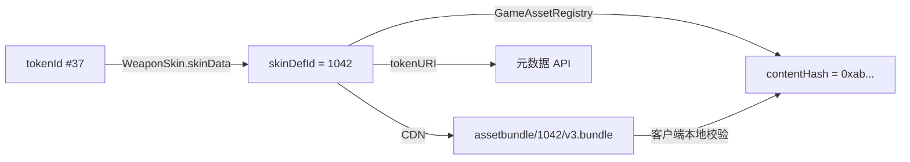

# 资产模型

## 为什么皮肤用 ERC-721 而不是 1155

同一款皮肤会铸造多件，看起来像 1155 的场景。但每件需要携带**独立的价值属性**：

- `serial` —— #1/500 的编号有真实溢价；
- `wear` —— 磨损值决定视觉与价格（CS 生态验证过的机制）；
- `seasonId` —— 首发赛季的溢价。

1155 的 fungible 语义无法承载"同 ID 不同价值"。所以：
**skinDefId 是款式，tokenId 是具体某一件。**

`wear` 铸造后不可变。可变的磨损会引入"谁有权修改玩家资产"的问题 —— 一旦发行方
能改，"真正拥有"就打了折扣。

## 外观契约：链上承诺 + 链下资源

这是整套设计里最容易做错的一环。Unity 加载的是 AssetBundle，不可能从链上读贴图。
但如果外观完全在链下，发行方就能事后把"传说级皮肤"悄悄改成灰模。

解法是**内容哈希承诺**：



规则：

1. `contentHash` = AssetBundle 的 keccak256（含 LOD、贴图、材质的完整包）；
2. Unity 下载后**本地校验哈希**，不匹配则降级到默认皮肤并上报 —— 不崩溃、
   不拒绝进入游戏（CDN 缓存不一致是运维常态，不该变成玩家的阻断问题），
   但要告警，因为它也可能是 CDN 被投毒；
3. 改资源必须走 `updateContentHash`，触发链上事件，变更历史公开可审计；
4. `freeze(skinDefId)` 后哈希永久锁死，用于"本赛季已结束、外观不再变更"的正式承诺。

> **实现坑**：keccak256 与 SHA3-256 的 padding 不同，Unity 侧直接用标准库的
> SHA3 会永远校验失败。需要引一个真正的 keccak 实现。

## 元数据（tokenURI）

`tokenURI(tokenId)` = `baseURI + tokenId`，由后端 API 动态生成而非静态 JSON
（serial/wear 从链上读，保证与链一致）：

```json
{
  "name": "霜蚀 AK-47 #37",
  "description": "第 2 赛季竞技场奖励。",
  "image": "https://cdn.example.com/skin/1042/preview.png",
  "external_url": "https://example.com/item/4475210235940901",
  "attributes": [
    {"trait_type": "Weapon", "value": "AK-47"},
    {"trait_type": "Rarity", "value": "Legendary"},
    {"trait_type": "Season", "value": 2},
    {"trait_type": "Serial", "value": 37, "max_value": 500},
    {"trait_type": "Wear",   "value": 0.0731, "display_type": "number"}
  ],
  "content_hash": "0xab...",
  "bundle_uri": "https://cdn.example.com/skin/1042/v3.bundle"
}
```

`content_hash` 和 `bundle_uri` 是给自家客户端的扩展字段，第三方市场会忽略。

主网上还应把元数据同步 pin 到 IPFS，并在款式 `frozen` 时把 CID 写上链 ——
这样游戏停服后元数据仍可访问。hackathon 阶段跳过。

## 稀缺性承诺

`maxSupply` 只能下调、不能上调，强制在 `GameAssetRegistry` 里。这是对玩家最实质的
承诺 —— 写在合约里比写在白皮书里可信一个数量级。`testFuzz_maxSupplyNeverIncreases`
fuzz 了这条路径。

销毁不回退 `minted`，**序号永不复用**。销毁只会让该款式更稀缺。

## 未实现：宝箱与开箱

刻意不做，原因不是没时间：

1. **随机数**在链上是最容易出安全事故的地方。`block.timestamp` / `prevrandao`
   在 L2 上排序器可预测。正确做法是提交-揭示（epoch 种子哈希提前上链、结束后
   公布明文，任何人可复算验证）或 Chainlink VRF，都不是一两天的活。
2. **合规**：中国大陆强制概率公示，比利时/荷兰可能认定开箱为赌博，韩国、
   部分美国州也有监管。开箱的地区可用性必须在产品阶段确认，不是上线前才补。

如果 demo 需要"开箱"的观感，用后端 `mintDirect` 配合前端动画即可，随机数在链下
产生 —— 但不要对外宣称这是"可验证的链上开箱"，那是两回事。

## 未实现：赛季 Merkle drop

批量发放（≥ 1000 人）时，一次上链一个 merkle root、成本 O(1)，比逐个 voucher
划算得多。当前只实现了单笔 voucher 和直铸。赛季结算规模上来时再补。
