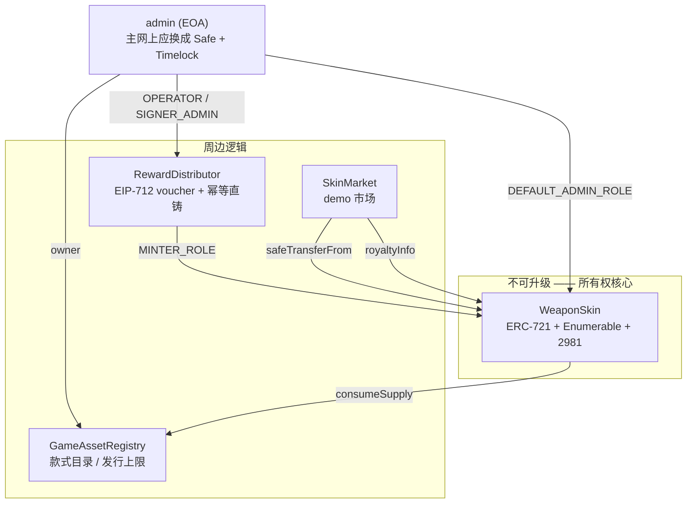

# 合约参考

本文档对齐 `contracts/src/` 的实际实现。改了代码就改这里。

## 全景



## 可升级性

**资产合约不可升级，这是刻意的。** 持有所有权的合约一旦可升级，一次升级就能加进
`adminBurn`，"我们无法收回你的资产"这句话立刻变成假的。不可升级是唯一诚实的选项。

代价：`WeaponSkin` 有 bug 只能部署新合约 + 引导玩家自愿迁移。为此把它压到最简
（只做 mint / transfer / 元数据指针），业务逻辑全在 `GameAssetRegistry` 和
`RewardDistributor` 里 —— 这两个合约当前也不可升级（hackathon 不值得引入代理），
但它们不持有所有权，重新部署的代价只是改后端地址配置。

## GameAssetRegistry

款式目录 + 发行上限的唯一强制点。

```solidity
struct SkinDefinition {
    uint32  maxSupply;    // 只能下调，降到 0 = 停止发行
    uint32  minted;       // 累计铸造数，销毁不回退
    uint8   rarity;       // 0..4
    bool    frozen;       // 冻结后 contentHash 永久不可变
    bool    exists;       // 款式是否已定义
    bytes32 contentHash;  // AssetBundle 的 keccak256 承诺
}
```

| 方法 | 权限 | 说明 |
|------|------|------|
| `defineSkin(id, maxSupply, rarity, contentHash)` | owner | id 一旦使用不可重定义 |
| `reduceMaxSupply(id, newMax)` | owner | 必须严格小于当前上限且 ≥ minted |
| `updateContentHash(id, hash)` | owner | 冻结后不可调用，触发链上事件供审计 |
| `freeze(id)` | owner | 单向，不可撤销 |
| `consumeSupply(id)` | 仅 `minter` 地址 | 原子占用额度并返回序号 |

### `exists` 为什么是独立字段

早期版本用 `maxSupply != 0` 表示"已定义"。fuzz 测试抓到了后果：
`reduceMaxSupply(id, 0)` 是合法调用（意思是"这款停止发行"），但它会把
`maxSupply` 设成 0，撞上"未定义"的哨兵值 —— 款式被静默抹掉，`getSkin` 和
`remainingSupply` 全部开始抛 `SkinNotDefined`，而 storage 里的 contentHash
和 rarity 还在。

把"未定义"和"已停止发行"两个不同状态挤进同一个哨兵值就是这个 bug 的成因。
回归测试见 `test_reduceMaxSupplyToZero_retainsDefinition`。

### 为什么上限强制放在这里

即使 `RewardDistributor` 的签名密钥被完全攻破，攻击者也只能把已定义款式铸到
上限为止。这是对「无限增发」这个最高危风险的最后一道防线，和权限系统解耦。
测试 `test_compromisedSignerCannotExceedMaxSupply` 专门模拟这个场景。

## WeaponSkin

ERC-721 + `ERC721Enumerable` + `ERC2981` + `AccessControl`。

```solidity
struct SkinData {          // 打包进 1 个 slot：32+32+16+32+64 = 176 bits
    uint32 skinDefId;
    uint32 serial;
    uint16 wear;           // 0..10000 万分比，铸造后不可变
    uint32 seasonId;
    uint64 mintedAt;
}
```

**tokenId = `(skinDefId << 32) | serial`** —— 从 tokenId 直接看得出是哪款的第几件，
前端、后端、客服都不用额外查询。代价是 tokenId 不连续，可读性的价值大于连续性。

| 角色 | 谁持有 | 能做什么 |
|------|--------|---------|
| `DEFAULT_ADMIN_ROLE` | admin | 授予/撤销角色、改版税 |
| `MINTER_ROLE` | **仅 RewardDistributor** | 铸造 |
| `URI_ADMIN_ROLE` | admin | 改 baseURI |

注意 admin **没有** `MINTER_ROLE`。所有铸造必须经过 `RewardDistributor`，
那里有 nonce / requestId 的幂等保护。测试 `test_mint_adminIsNotAutomaticallyMinter`
守着这一点。

### 刻意不存在的方法

`adminTransfer` / `adminBurn` / `setTransferEnabled` / `forceTransferFrom`。
任何一个都会让"玩家真正拥有"失效。`test_noAdminBackdoors` 用低阶 call 探测这些
选择器，如果哪天有人加回来，测试会变红。

`burn` 只有持有者本人能调 —— 连被 `setApprovalForAll` 授权的操作者也不行，
因为销毁是所有权行为，approve 不应传递销毁权。

### 为什么带 Enumerable

`tokensOfOwner()` 让 web 端和游戏后端直接读库存，**整个索引服务可以不做**。
代价是 gas（见下表）。这是 hackathon 的正确取舍：省掉一个需要处理 reorg、
断线续传、多实例选主的服务，换每次铸造多花约 8 万 gas（实测值见下）。

上主网前如果 gas 成为瓶颈，再换成自建 indexer。

## RewardDistributor

两条发放路径共存：

| | `claim`（pull） | `mintDirect`（push） |
|---|---|---|
| 谁付 gas | 玩家（或 Paymaster 代付） | 后端 |
| 玩家操作 | 需要在浏览器确认 | 零操作 |
| 上链成本 | 只在玩家真想要时发生 | 每个奖励都上链 |
| 防重 | EIP-712 nonce bitmap | `requestId` 幂等键 |
| 适合 | 高价值奖励、省成本 | **demo 主线**，体验最顺 |

### voucher 结构

```solidity
Voucher(address player, uint32 skinDefId, uint16 wear,
        uint32 seasonId, uint256 nonce, uint64 deadline)
```

EIP-712 domain 含 `chainId` + `verifyingContract`，所以测试网签名无法在主网重放
（`test_claim_revertsOnCrossChainReplay` 覆盖）。

`claim` 允许**任何人代为提交**，NFT 始终铸给 `voucher.player` —— 这是为了支持
relayer / Paymaster 代付 gas。`test_claim_relayerCannotStealReward` 守着这一点。

### nonce 用 bitmap

`mapping(address => mapping(uint256 => uint256))`，每个 nonce 只占 1 bit，
比 `mapping(uint256 => bool)` 省约 80% gas。

实现里有个坑值得记下来：`1 << bitPos` 中字面量 `1` 的类型推导在 Solidity 里
不直观，若被推导成小整数类型，高位 nonce 会被截断成 0，导致 nonce 复用。
代码里显式写成 `uint256(1) << bitPos`，`testFuzz_highNoncesWork` 是回归测试。

### signer 轮换的取舍

`setSigner` 会立即作废旧 signer 签发的所有未使用 voucher，**包括合法的**。
这是刻意的：密钥泄露时宁可让玩家重领一次，也不能让攻击者继续铸造。后端的待领
奖励记录还在，重新签发对玩家无感。

## SkinMarket

极简固定价格市场：挂单 / 撤单 / 购买，原生币计价（Monad 上是 MON），按 EIP-2981 分版税。

**存在的理由**：demo 需要当场可演示的完整交易闭环，而测试网的第三方市场索引
不稳定，经常看不到刚铸造的 NFT。**上主网时应改为直接依赖 Seaport** —— 自建
市场做不出流动性。

刻意的简化：

- 直接 push 转账而非 pull payment。卖家若是 `receive` 会 revert 的合约，交易失败。对 EOA 玩家无影响。
- 无出价、无拍卖、无批量购买。
- 无平台手续费，收入完全来自版税。

**僵尸挂单**：卖家挂单后可能把 NFT 转走或撤销授权。`buy` 会检查卖家是否仍持有
（`ListingStale`），`isActive()` 供前端过滤展示。

## 版税

EIP-2981，默认 5%，收款地址为 treasury。

必须坦诚：**EIP-2981 只是信息接口，不强制执行**。Blur 等市场可以忽略它。可强制
的方案（ERC-721C、转移白名单）代价是限制玩家的转移自由，与核心承诺直接冲突。

**决策：采用 EIP-2981，不做强制。** 宁可少收版税，也不破坏"自由流通"。

## 实测 gas

`forge test --gas-report` 的中位数，optimizer runs = 200：

| 操作 | 中位 gas | 备注 |
|------|---------|------|
| `RewardDistributor.claim` | 211k | 含 ECDSA 验签 + nonce bitmap + Enumerable |
| `RewardDistributor.mintDirect` | 215k | 含 requestId 幂等写 |
| `SkinMarket.buy` | 143k | 含 721 转移 + 版税分账 |
| `SkinMarket.list` | 55k | |
| `WeaponSkin.transferFrom` | 81k | |
| `WeaponSkin.tokensOfOwner` | ~5k | view，仅链下调用 |

### Enumerable 的实测代价

`test/EnumerableCost.t.sol` 用同样的铸造逻辑做了个去掉 `ERC721Enumerable` 的
对照组，直接量出差值（`gasleft()` 测量，不含 21k 交易基础费）：

| 操作 | 带 Enumerable | 对照组 | 差值 |
|------|--------------|--------|------|
| 首次铸造 | 169,357 | 89,067 | **+80,290** |
| 转移 | 55,149 | 29,047 | **+26,102** |

这就是换掉整个索引服务的价格 —— 省下一个需要处理 reorg、断线续传、多实例选主
的服务。在 Monad 上按其 gas 定价换算，单次铸造成本可忽略，
hackathon 完全可接受。

真上量之后如果这笔钱变得显著（比如日铸造上万），再换成自建 indexer 也不迟：
`tokensOfOwner` 只在后端调用，换实现不影响 `IGameAssetGateway` 契约。

## 测试

`forge test` —— 125 个测试，含 7 个 invariant（各 256 轮 × 500 次调用）。

值得单独提的几个：

| 测试 | 守什么 |
|------|--------|
| `invariant_mintedNeverExceedsMaxSupply` | 任意调用序列下发行上限不被突破 |
| `test_compromisedSignerCannotExceedMaxSupply` | 签名密钥完全泄露时的纵深防御 |
| `test_noAdminBackdoors` | 没有管理员后门 |
| `test_claim_revertsOnTamperedFields` | 篡改 voucher 任一字段都失效 |
| `test_claim_revertsOnCrossChainReplay` | 测试网签名不能在主网用 |
| `test_mintDirect_isIdempotent` | 游戏服务器重试不会重复发奖 |
| `testFuzz_accountingBalances` | 市场分账每一 wei 都有去处 |
| `test_reduceMaxSupplyToZero_retainsDefinition` | 哨兵值 bug 的回归测试 |

## 部署到 Monad

| | chain ID | RPC |
|---|---|---|
| 测试网 | `10143` | `https://testnet-rpc.monad.xyz` |
| 主网 | `143` | `https://rpc.monad.xyz` |

```bash
export PRIVATE_KEY=0x...
export REWARD_SIGNER_ADDRESS=0x...            # 后端签发 voucher 的地址
export MONAD_TESTNET_RPC_URL=https://testnet-rpc.monad.xyz

forge script script/Deploy.s.sol:Deploy --rpc-url monad_testnet --broadcast

# 灌 demo 款式（可选给测试地址发两件）
REGISTRY_ADDRESS=0x... DISTRIBUTOR_ADDRESS=0x... DEMO_PLAYER=0x... \
  forge script script/SeedSkins.s.sol:SeedSkins --rpc-url monad_testnet --broadcast
```

### 验证走 Sourcify，不是 Etherscan

```bash
forge verify-contract <address> WeaponSkin \
  --chain 10143 \
  --verifier sourcify \
  --verifier-url https://sourcify-api-monad.blockvision.org/
```

两个容易踩的点：

- **`--verifier-url` 结尾的斜杠不能省**，少了会验证失败；
- `foundry.toml` 里已经配好 `bytecode_hash = "none"` + `use_literal_content = true`，
  这是 Sourcify 需要的（不写 IPFS 哈希、源码内联）。

因为不走 Etherscan，`forge script` 的 `--verify` 一把梭不适用，部署后单独验证每个合约。

### `evm_version` 必须是 cancun

Monad 支持到 Cancun 分叉为止，**不支持 Prague 操作码**。`foundry.toml` 里已显式
钉死 `evm_version = "cancun"`。

不要删掉这行去吃 solc 的默认值 —— 默认值会随编译器升级漂移，哪天升到默认 prague
就会编译出 Monad 上无法部署的字节码，而且要到部署那一刻才发现。

### 移交权限

`Deploy` 脚本在 `ADMIN_ADDRESS` 与部署者不同时，会把全部角色转给 admin 并
撤掉部署者的权限。**主网部署必须用这条路径**，部署密钥不应长期持有权限。

## Monad 并行执行下的存储热点

Monad 乐观并行执行交易，写同一个 storage slot 的交易会冲突并被重新执行。
不影响正确性，影响吞吐。这套合约有两处：

| 热点 | 冲突范围 |
|------|---------|
| `GameAssetRegistry._skins[id].minted` | 同款皮肤的并发铸造 —— 这是发行上限的强制点，本来就必须串行 |
| `ERC721Enumerable._allTokens` 长度槽 | **整个 collection 的每次铸造/销毁**，全局热点 |

在顺序执行的链上 Enumerable 只让我多花 gas；在 Monad 上它还吃并行度。

**当前不改** —— hackathon 的并发量到不了有影响的量级。但换掉 Enumerable 的触发
条件多了一条：除了"gas 成为瓶颈"，还有"持续高并发铸造"（赛季结算上万人同时领奖）。
届时改为自建 indexer + 去掉 Enumerable，铸造之间就不再互相冲突。
