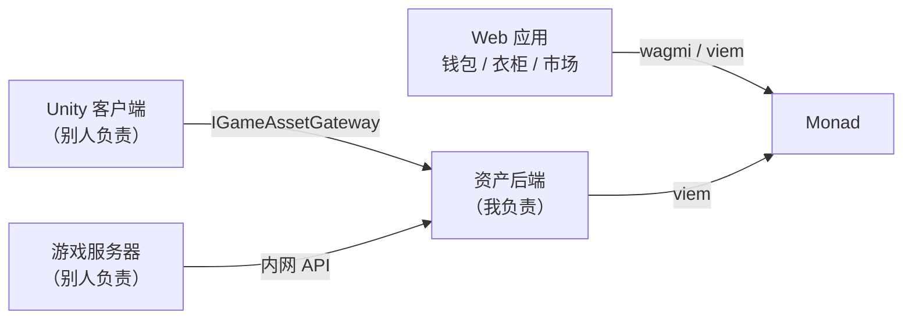

# 集成：后端与 Unity

## 分工



Web3 侧负责：合约、资产后端、Web 应用。
游戏侧负责：Unity 客户端、游戏服务器。
两边只对齐两样东西：**`api/openapi.yaml`** 和 **`IGameAssetGateway`**。

## 资产后端要做的四件事

hackathon 尺度，一个 Node/TS 服务就够，不需要拆微服务。

### 1. 库存读取 `GET /v1/assets`

```ts
const tokenIds = await weaponSkin.read.tokensOfOwner([wallet])
const items = await Promise.all(tokenIds.map(async (id) => {
  const data = await weaponSkin.read.skinData([id])
  const def  = await registry.read.getSkin([data.skinDefId])
  return toSkinItem(id, data, def)
}))
```

靠 `ERC721Enumerable` 直接读链，**不需要索引服务**。加一层 15–30 秒的缓存
（Redis 或进程内 Map）即可，因为资产变动本来就不频繁。

`stalenessSeconds` 如实返回缓存年龄，让客户端能提示"同步中"。

### 2. 结算发奖

游戏服务器推对局结果 → 后端调 `mintDirect`：

```ts
const requestId = keccak256(encodeAbiParameters(
  [{type:'string'},{type:'string'},{type:'uint8'}],
  [matchId, playerId, slot]
))
await distributor.write.mintDirect([wallet, skinDefId, wear, seasonId, requestId])
```

**幂等键必须是 `(matchId, playerId, slot)`**。游戏服务器重试推送是常态，重复
发奖是事故。合约侧已经用 `requestId` 挡住了重复铸造，但后端也要在自己的表上
建唯一索引，避免每次重试都白烧一笔 gas。

奖励绑定 **playerId（游戏账号）而非钱包地址** —— 钱包是账号的一个属性，可以更换；
奖励的归属必须锚在账号上。**已与游戏侧确认（2026-08-08）：Web 应用与游戏共用
同一套账号，账号为父、钱包为子** —— 本文的绑定流程即最终形态。

### 3. 钱包绑定

玩家用传统方式登录游戏账号，钱包是**后绑定的属性**。

```
POST /v1/wallet/bind        → { sessionId, bindUrl }
  Unity 用系统浏览器打开 bindUrl
  Web 页面：钱包登录（见下方"钱包选型"）→ SIWE 签名（含 nonce + sessionId）
  后端验签 → 绑定 playerId ↔ address
GET  /v1/wallet/bind/{id}   → { state: "bound", wallet }
```

- SIWE（EIP-4361）消息必须含 nonce、domain、过期时间；
- 一个 playerId 只能绑一个地址；
- 后端**不持有玩家私钥**，只记录地址。

#### 钱包选型

目标用户是 FPS 玩家，不是 DeFi 用户 —— **要求助记词等于转化率归零**。所以优先
选嵌入式钱包（社交 / 邮箱登录即得非托管钱包），把"装插件 + 抄助记词"这步彻底去掉。

Monad 上可用的方案：

| 方案 | 特点 |
|------|------|
| **Privy** | 对 Monad 测试网用量有补贴，wagmi 集成成熟。**建议 demo 用这个** |
| MetaMask Embedded Wallets | Google / Apple OAuth 一键登录，官方文档有 Monad 专章 |
| Crossmint | 邮箱 / 社交 / passkey / 短信多种签名方式的智能合约钱包 |
| 注入式钱包（MetaMask 插件等） | 兜底，给已经有钱包的玩家 |

两点提醒：

1. **嵌入式和注入式同时支持。** 评委里既有装了钱包的也有没装的，
   wagmi 的 connector 列表两种都放。
2. 链配置自己定义一次、前后端共用，别在多处硬编码 chainId：
   测试网 `10143` / 主网 `143`，原生币 `MON`。

### 4. 开局核验 `POST /internal/v1/entitlement-check`

游戏服务器在开局前调用，校验 loadout 里每个 tokenId 确实属于该玩家。
返回 `snapshotId`，游戏服务器持有它直到本局结束。

**这个端点不在 `IGameAssetGateway` 里** —— Unity 客户端不应该能调用它。

## 降级：Web3 故障不得阻断游戏

这是整个集成的底线。

| 依赖故障 | 行为 |
|---------|------|
| 链 RPC 不可用 | 库存读缓存；领奖功能灰显 + 提示。游戏本体不受影响 |
| 缓存与数据库都不可用 | **允许玩家用默认皮肤开局** |
| contentHash 校验失败 | 降级到默认皮肤 + 上报告警，不崩溃、不拦人 |

资产层是增值，不是依赖。

## Unity 侧

抽象层在 [`packages/unity-sdk/`](../packages/unity-sdk/README.md)，把 `Runtime/`
拷进 Unity 工程即可，无外部依赖。

Unity **不直接连链**，理由是安全：IL2CPP 可逆向、内存可 dump，而 FPS 是外挂工具
的重点目标。客户端里一旦有私钥，作弊工具会顺手加上盗号功能。所以链路是
**Unity → 游戏后端 → 链**，Unity 侧只是个 REST 客户端。

给 Unity 的五条硬约束（详见 SDK README）：

1. 对局中不调用任何 gateway 方法，只在大厅调；
2. `tokenId` 一律当字符串处理（uint256 放不进 `ulong`）；
3. 绑定钱包用系统浏览器，不要用内嵌 WebView；
4. 其他玩家的皮肤由游戏服务器下发，不信任客户端自报的皮肤 ID；
5. 所有 gateway 调用都要有 catch 和降级路径。

### 并行开发

`MockGameAssetGateway` 是全内存假实现，模拟了完整状态流转（延迟、绑定等待、
领奖时序、失败注入）。Unity 侧不需要等合约部署、后端上线、测试网出块，
第一天就能把衣柜和领奖 UI 做完。

```csharp
IGameAssetGateway gateway = useMock
    ? new MockGameAssetGateway()
    : new HttpGameAssetGateway(apiBaseUrl, () => session.AccessToken);
```

## 接口变更流程

`openapi.yaml` 和 `IGameAssetGateway.cs` 是契约。要改：先改这两个文件，
再改两边实现。不要一边先改了让另一边去猜。
